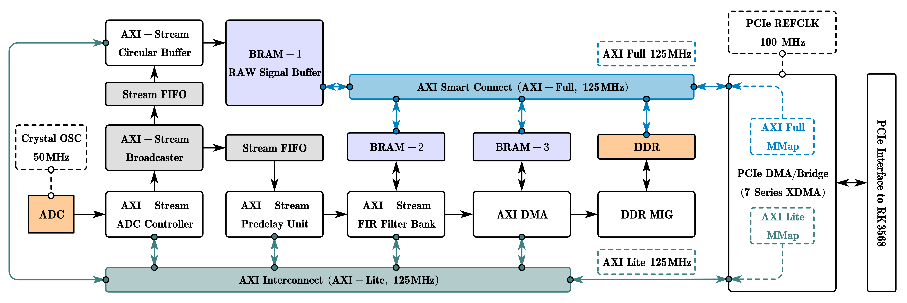
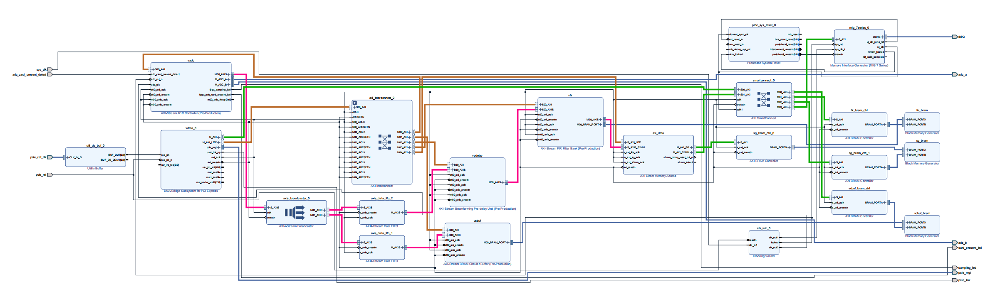
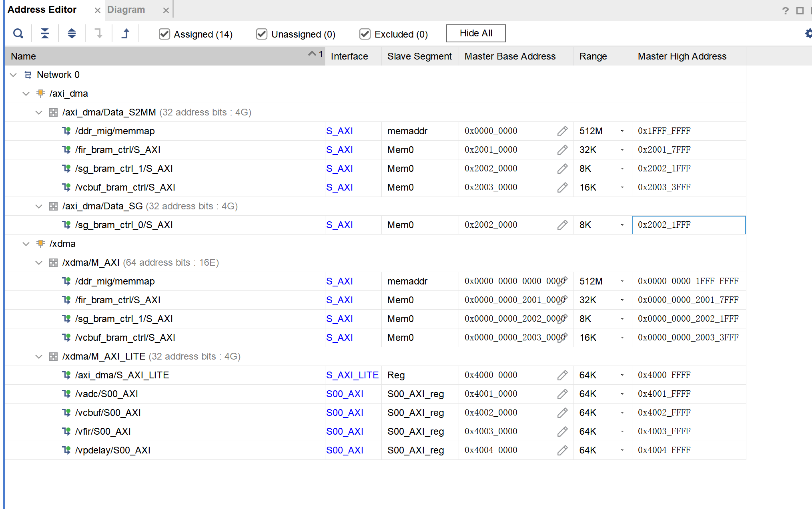
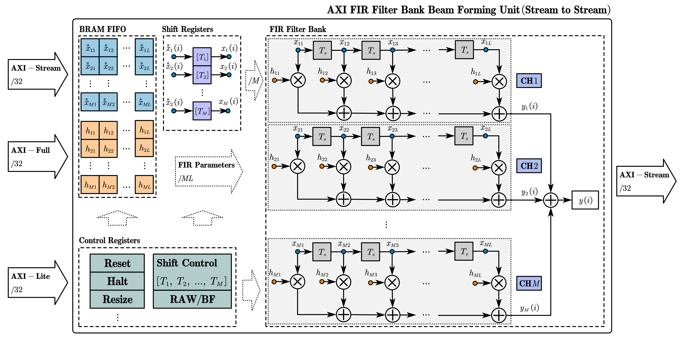

# 故障定位与识别系统 `FPGA` 仓库

本仓库用于存放 `FPGA` 的工程代码, 包括各个 `IP` 核设计和工程设计, 地址分配等.  

## VIVADO Block Design

     

     

[[ 查看`Block Design`详细设计 ]](./docs/vbd.pdf)
[[ 回到主仓库: vuprs-support ]](https://github.com/ShixuanLiu9527/vuprs-server.git)

## AXI 总线地址分配

     

## `FPGA` 侧硬件时域宽带 `FIR` 滤波器波束形成器算法框图

    

## 主要 IP 核寄存器配置与使用说明

### AXI-Stream ADC Controller

[`AXI-Stream ADC Controller` Programming Manual](./docs/m_adc_controller.md)

### AXI-Stream BRAM Circular Buffer

[`AXI-Stream BRAM Circular Buffer` Programming Manual](./docs/m_circular_buffer.md)

### AXI-Stream Beamforming Pre-delay Unit

[`AXI-Stream Beamforming Pre-delay Unit` Programming Manual](./docs/m_predelay.md)

### AXI-Stream FIR Filter Bank

[`AXI-Stream FIR Filter Bank` Programming Manual](./docs/m_fir.md)

---
_Shixuan Liu 2026_
