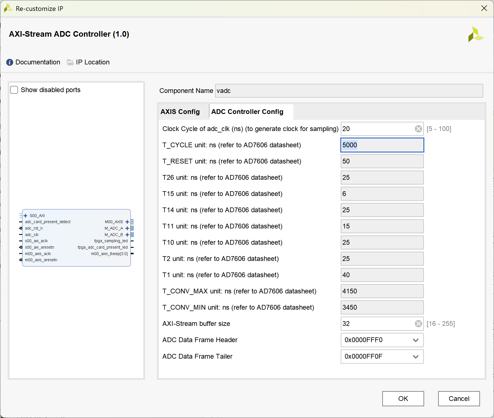

# `AXI-Stream ADC Controller` Programming Manual

## IP 核简要描述

该 `IP` 核通过控制 `ADC` 芯片引脚电平, 完成系统数据采样.  
为了控制采样 (采样频率, 采样点数, 挂起/复位, 持续采样等) `ARM` 端通过 `AXI-Lite` 总线访问 `IP` 核中的寄存器, 以达到控制目的.  
采样得到的数据通过 `AXI-Stream` 总线发送. 该 `IP` 核每次都同时采样 `16` 个通道, 并加入帧头和帧尾, 便于下游模块区分通道位置.  

## 寄存器列表

| `Address` | `Name` | `R/W` | `Description` |
| :--- | :--- | :--- | :--- |
| `0x00` | `SCI` | `R/W` | 采样控制时钟分频系数 (Sampling Clock Increment) |
| `0x04` | `SP` | `R/W` | 采样点数 (Sampling Points) |
| `0x08` | `SF` | `R/W` | 采样帧数 (Sampling Frames) |
| `0x0C` | `STR` | `R/W` | 采样触发/模块就绪 (Sampling Trigger & Ready) |
| `0x10` | `NGF` | `R` | 已生成帧数 (Number of Generated Frames) |
| `0x14` | `ERR` | `R` | 错误信息 (Error Flags of ADC) |
| `0x18` | `RST` | `R/W` | 模块软件复位 (Reset ADC) |
| `0x1C` | `CS` | `R/W` | 持续采样控制 (Continuous Sampling) |

### `SCI` (Sampling Clock Increment, offset = `00H`)

`ADC` 工作时钟通过外部高精度晶振输入, 在 `FPGA` 中被锁定为 `50 MHz`. `ADC` 采样触发时钟通过工作时钟分频得到, 该寄存器即设置分频系数, 采样频率 $f_{sampling}$ 和 周期 $T_{sampling}$ 与寄存器 `SCI` 取值的关系为:  
  
$$f_{sampling} = \frac{50 \times 10 ^ 6}{2 \times SCI}\ (Hz)$$
$$T_{sampling} = 40 \times SCI\ (ns)$$

### `SP` (Sampling Points, offset = `04H`)
  
该寄存器的值是 `ADC` 在每一帧中的采样点数, 为了便于傅里叶变换等应用, 建议将该值设置为 `2` 的指数幂.  
  
### `SF` (Sampling Frames, offset = `08H`)
  
该寄存器的值是 `ADC` 的采样帧数目. 结合 `SP` 寄存器的值, 总采样点数 $N_{sampling}$ 通过下式计算:  
  
$$ N_{sampling} = SP \times SF\ (points)$$
  
每个采样点都会产生 `16` 个通道的 `16` 位 `ADC` 数据, 因此 $N_{sampling}$ 对应的数据字节数 $C_{sampling}$ 为:  

$$ C_{sampling} = 32 \times N_{total}\ (bytes)$$
  
### `STR` (Sampling Trigger & Ready, offset = `0CH`)
  
**对该寄存器的任何写操作都会触发采样** (这些写操作不会实际作用于寄存器, 但是会被内部触发器捕捉从而触发采样).  
同时该寄存器的 `0` 位用于显示上一个任务是否完成:  

**STR寄存器**
| Bits | Name | Description |
| :---: | :---: | :--- |
| `0` | `RDY` | `0` = 上一次采样正在进行中, 新的配置数据不能写入;  `1` = 上一次采样结束, 可以写入新数据并触发新一轮采样; |
| `[31: 1]` | - | Reserved |
  
### `NGF` (Number of Generated Frames, offset = `10H`)
  
该寄存器的值表明当前采样帧数, 可以用于监控采样进度.  
  
### `ERR` (Error Flags of ADC, offset = `14H`)

该寄存器的值表明当前遭遇的错误情况, 寄存器的每一段表示不同模块的错误信息:  

**ERR寄存器**
| Bits | Name | Description |
| :---: | :---: | :--- |
| `[3: 0]` | `ADC_A_ERR` | `ADC-A` 的硬件错误代码 |
| `[7: 4]` | `ADC_B_ERR` | `ADC-B` 的硬件错误代码 |
| `8` | `BOF` | `1` = `AXI-Stream` 接口缓冲区溢出错误; `0` = 没有错误. |
| `9` | `ERR_POINTER` | `1` = `AXI-Stream` 接口缓冲区指针错误; `0` = 没有错误 |
| `[31: 10]` | - | Reserved |

`ADC` 硬件错误代码类型如下:  
| Code | Name | Description |
| :---: | :--- | :--- |
| `0000` | No Error | 采样正常 |
| `0001` | Conversion Timeout | 模数转换超时 |
| `0010` | FIRST_DATA Error Status | 引脚 `FIRST_DATA` 电平信号错误: `情况1` 在第 `1` 通道读取时不是高电平; `情况2` 在其他通道读取时不是低电平. |
| `0011` | Internal Registers Error | `ADC` 控制器内部寄存器状态错误, 系统可能受到极强干扰 |
| `0100` | Sampling Timeout | 采样流程整体超时 |
| `0101` | Unable to Start Sampling | 无法开启采样, `ADC` 芯片的 `Busy` 引脚没有自动拉高 |
| `0110` | Sampling Too Fast | 采样频率设置过高, 无法满足定时采集 |

### `RST` (Reset, offset = `18H`)

对该寄存器的任何写操作会触发复位.  

### `CS` (Continuous Sampling, offset = `1CH`)

该寄存器用于控制持续采样, 寄存器描述如下:  
  
**CS寄存器**
| Bits | Name | Description |
| :---: | :---: | :--- |
| `0` | `IS_CS` | `0` = 定点采样;  `1` = 持续采样; |
| `[31: 1]` | - | Reserved |

当 `IS_CS` 为 `1'b1` 时, 寄存器 `SP` 和 `SF` 失效, 仅需通过 `SCI` 寄存器设置采样频率.  

## 采样流程

对于每一次采样, 请严格按照以下步骤操作寄存器:  
  
`Step 1`: (等待上一次采样完成, 或施加软件复位) 读 `STR` 寄存器, 等待 `STR[0]` 被硬件置位;  
`Step 2`: 向 `SCI` 寄存器写入正确的分频系数;  
`Step 3`: 如果需要, 向 `SP` 寄存器写入期望的采样点数;  
`Step 4`: 如果需要, 向 `SF` 寄存器写入期望的采样帧数;  
`Step 5`: 如果需要, 配置 `CS` 寄存器的 `bit0` 开启持续采样, 此时 `Step 3` & `Step 4` 的操作无效;  
`Step 5`: 向 `STR` 寄存器写入任意值, 开启采样;  
`Step 6`: (等待本次采样完成) 如果需要, 读 `STR` 寄存器, 等待 `STR[0]` 被硬件置位;  

## 关于数据帧头和数据帧尾

帧头和帧尾为 `32` 字节, 请在 `IP` 核配置界面设置需要的帧头和帧尾:  

---
_Shixuan Liu 2026_